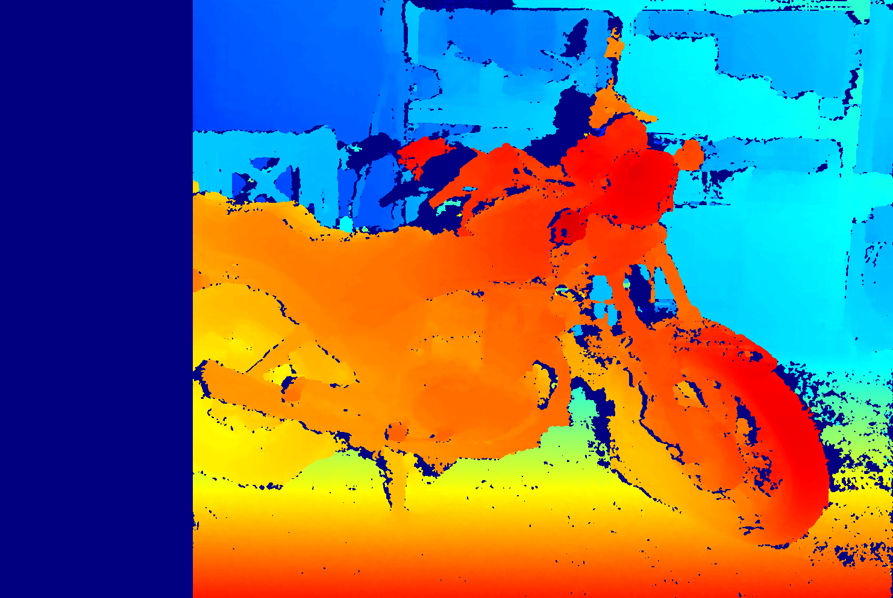
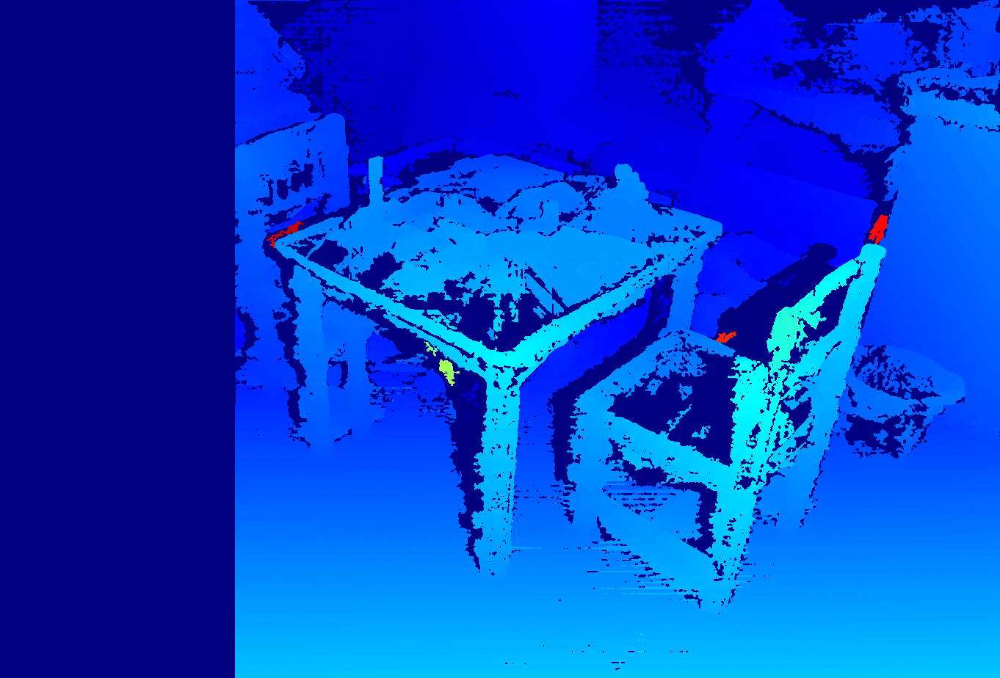

# libstereosgbm
test implementation for SGBM 

```commandline
root@waragai-orin:~/libstereosgbm# python3 sgbm_class.py -h
usage: sgbm_class.py [-h] [--save_numpy SAVE_NUMPY] [-l LEFT_IMGS] [-r RIGHT_IMGS] [--output_directory OUTPUT_DIRECTORY] [--max_disp MAX_DISP]

optional arguments:
  -h, --help            show this help message and exit
  --save_numpy SAVE_NUMPY
                        save output as numpy arrays
  -l LEFT_IMGS, --left_imgs LEFT_IMGS
                        path to all first (left) frames
  -r RIGHT_IMGS, --right_imgs RIGHT_IMGS
                        path to all second (right) frames
  --output_directory OUTPUT_DIRECTORY
                        directory to save output
  --max_disp MAX_DISP   max disp of geometry encoding volume
```

```commandline
python3 usb_cam.py -h
usage: usb_cam.py [-h] [--calc_disparity] [--max_disp MAX_DISP] video_num

disparity tool for ZED2i camera as usb camera

positional arguments:
  video_num            number in /dev/video

optional arguments:
  -h, --help           show this help message and exit
  --calc_disparity     calc disparity
  --max_disp MAX_DISP  max disp of geometry encoding volume

```

## StereoSGBM



## 
 python3 sgbm.py 
loading images...
computing disparity...
saving disparity as disparity_image_sgbm.txt

https://github.com/grzlr/bm_sgbm/blob/master/src/sgbm.py


## npy file viewer and helper script for zed camera(StereoLabs)

    https://github.com/katsunori-waragai/disparity-view

```commandline
pip install disparity-viewer
view_npy enable you to npy files as pseudo-colored images.
zed_capture will make it easy access to zed camera.
```


